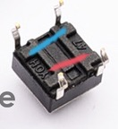
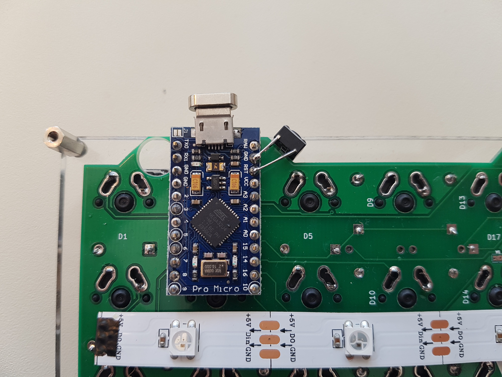
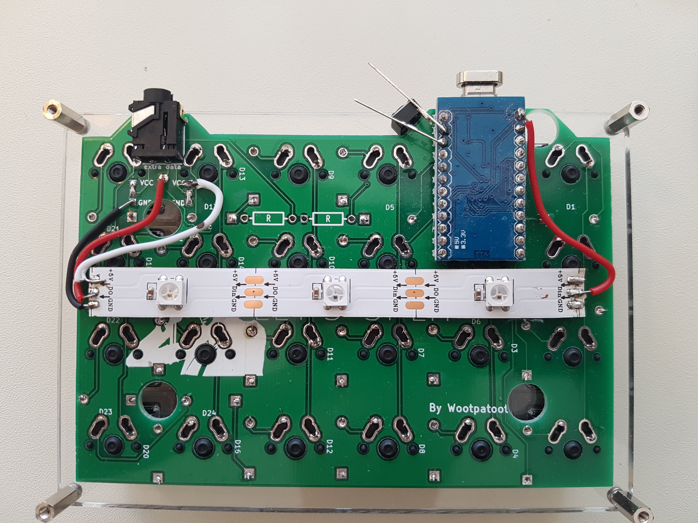
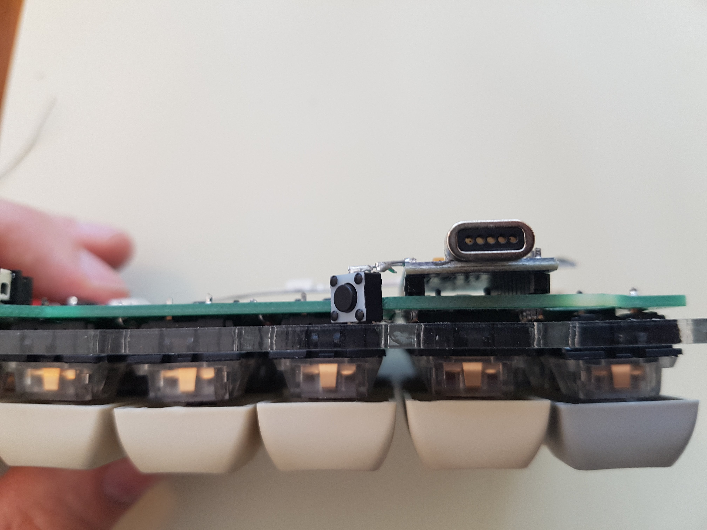

# Reset Buttons

<!-- START doctoc generated TOC please keep comment here to allow auto update -->
<!-- DON'T EDIT THIS SECTION, INSTEAD RE-RUN doctoc TO UPDATE -->

- [Parts](#parts)
- [Assembly](#assembly)

<!-- END doctoc generated TOC please keep comment here to allow auto update -->

It can be useful to set the Pro Micro in boot loader mode to upload new firmware. This is done by connecting the _Reset_ pin to ground. To simplify this a push button can be connected to _RST_ and _GND_ on each Pro Micro.

## Parts

- [ ] 2 [Tactile Push Button Switch Momentary Tact 6x6x5mm DIP Through-Hole 4pin](https://www.aliexpress.com/item/100pcs-Tactile-Push-Button-Switch-Momentary-Tact-6x6x5mm-DIP-Through-Hole-4pin/1405424572.html?spm=a2g0s.9042311.0.0.27424c4dcX98gi)
- [ ] 4 Diod legs

## Assembly

First verify how to connect the push buttons. The ones in the parts list connects the two pins one each end of the two lines.

If you bend the two unused legs a bit towards the middle, they will rest against the PCB. Use the diod legs to extend the push button legs directly to the Pro Micro. Since the Pro Micros are mounted different ways the two push buttons both will face right, see the images.

**Right Hand**

**Left Hand (before the diod legs have been trimmed)**

**Right Hand in profile**

