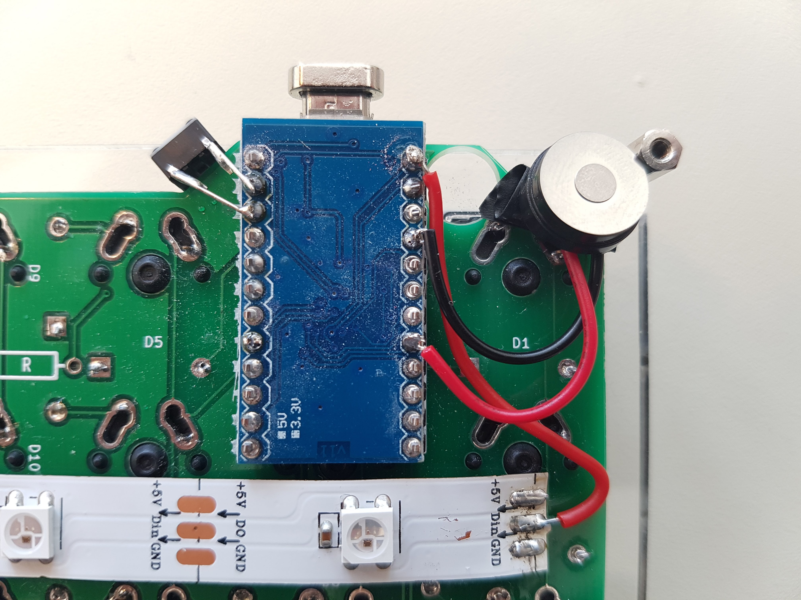

# Speaker

<!-- START doctoc generated TOC please keep comment here to allow auto update -->
<!-- DON'T EDIT THIS SECTION, INSTEAD RE-RUN doctoc TO UPDATE -->

- [Parts](#parts)
- [Assembly](#assembly)
- [Firmware](#firmware)

<!-- END doctoc generated TOC please keep comment here to allow auto update -->

## Parts

- [ ] 1 [Mini Plug Speaker](https://www.aliexpress.com/item/10Pcs-Mini-Plug-Speaker-For-PC-Interanal-BIOS-Computer-Motherboard-Mini-Onboard-Case-Buzzer-Board-Beep/32839787014.html?spm=a2g0s.9042311.0.0.27424c4d7dYByk)

## Assembly

Cut off the connector and connect one wire from the mini speaker to pin
_5 (C6)_ and the other to _GND_ on the master side. Depending on your case
and how you position it, it might be necessary to remove the cap of the
speaker to make it fit. Secure it with some tape or glue so it doesn't short
circuit anything.

**Speaker (Left Hand)**

## Firmware

In QMK you need to enable audio `AUDIO_ENABLE = yes` and `#define C6_AUDIO`,
see [Documentation: QMK Firmware - Audio](https://docs.qmk.fm/#/feature_audio).
You can't both have [RBG Underglow](rgb-underglow.md) and _Audio_ enabled at
the same time since the firmware will be to large to fit in a Pro Micro.
